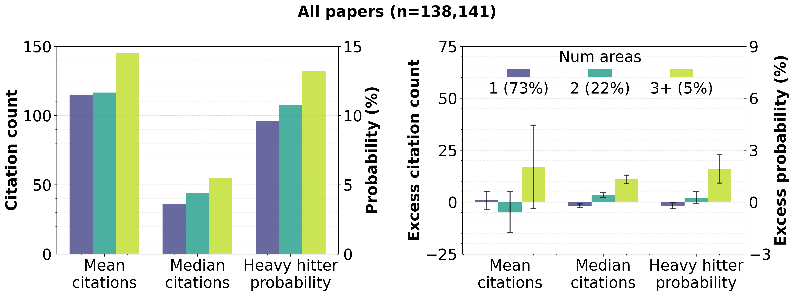
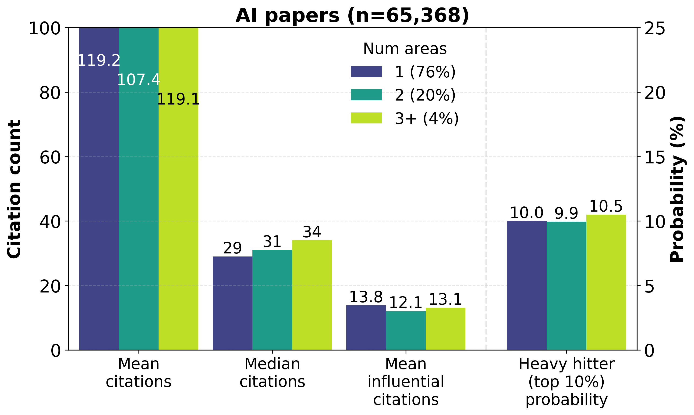
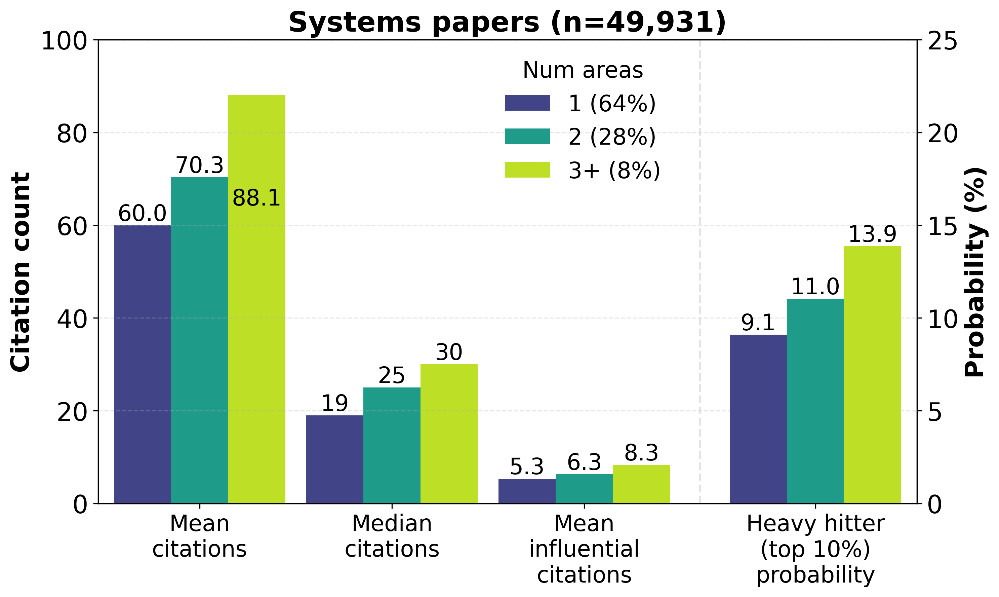
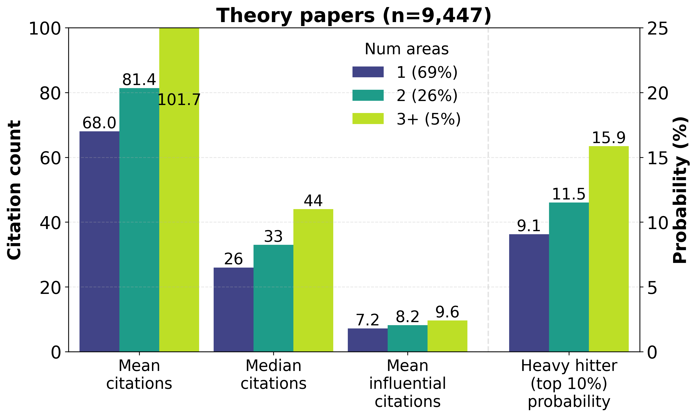
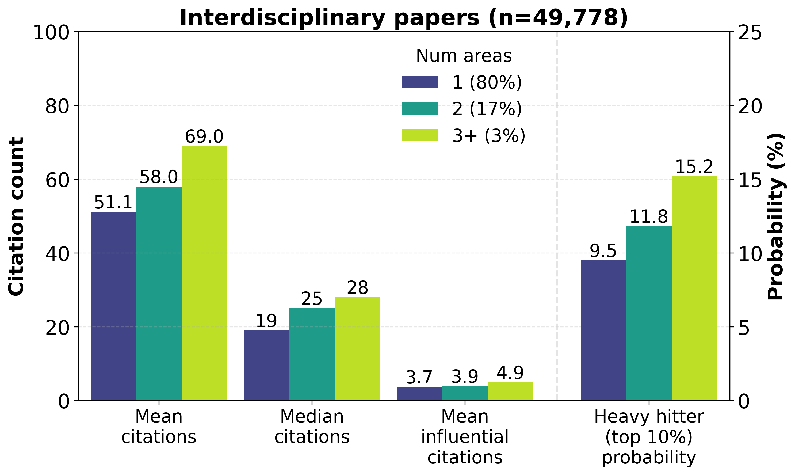
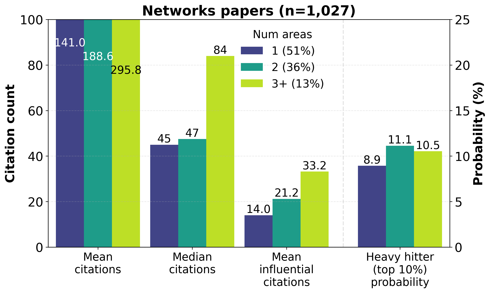
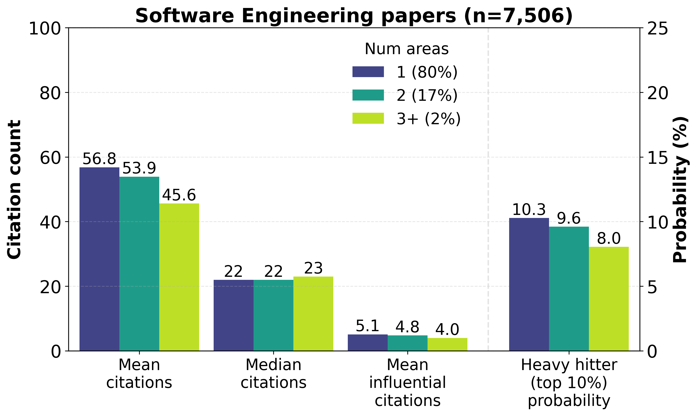

# Cross-area collaboration and citations in computer science

*Ratul Mahajan*

November 15, 2025

---

## Methodology

I want to study the relationship between collaboration, especially across different areas of study within computer science, and the quality of the resulting research. But good research is notoriously difficult to define, especially at scale. While a researcher may be able to classify a paper as good (or bad) after careful consideration, it is hard for them to do so for thousands of papers that are published each year and it is even harder for any large group of researchers to agree on the classification. Thus, despite its flaws, I use citations as a proxy measure of quality, with the expectation that good research tends to be cited more. To differentiate between raw citations, which include passing references to prior work,  and meaningful citations, I will also consider [influential citations](https://www.semanticscholar.org/faq/influential-citations) from [Semantic Scholar](https://www.semanticscholar.org/faq/influential-citations), which "identifies citations where the cited publication has a significant impact on the citing publication."

<!-- 387512 -->

I crunched the numbers as follows. Started with all DBLP papers from the last 10 years (2015-25), I kept those that were published in a venue recognized by [CSRankings](https://csrankings.org/) *and* had an author recognized by CSRankings. This filtering kept 164,457 out of 252,627 (65%) papers. I then got citation counts from [Semantic Scholar](https://www.semanticscholar.org/faq/influential-citations), using the paper's DOI (digital object identifier) or title+year. I could find citation information for 157,683 papers (96%), I ignored the other papers. 
<!-- I also got counts of [influential citations](https://www.semanticscholar.org/faq/influential-citations) from Semantic Scholar, which "identifies citations where the cited publication has a significant impact on the citing publication." -->

https://csrankings.org/faq.html

I binned papers into 3 groups based on the primary areas of its authors. Areas are fields of study like computer vision, computer networks, and algorithms; CSRankings identifies 27 distinct areas. The primary area of an author is based on the venue in which they've published the most papers. In the first group, all authors belong to the same area. The second group has authors from two areas, and the third group has 3 or more areas. This binning ignores the areas of authors not in the CSRankings database, which implies ignoring non-faculty authors and non-CS faculty.

If collaboration leads to better research and consequently more citations, then 1-area papers must get fewer citations than 2-area papers, and 3+-area papers must get the most citations. I analyzed this relationship using four measures: mean citation counts, median citation counts, mean influential citation counts, and "heavy hitter" probability. The last measure computes the fraction of a group's papers in top 10% based on citation count. It answers the question: Are papers based on cross-area collaboration more likely to be heavily cited?

## Results

Lets begin by studying all papers in the pool. See the graph below.

Surprisingly, there appears to be negligible correlation between cross-area collaboration and citation metrics. There is some improvement with 3+ areas, but that is a small fraction of papers and the improvement is XXX.

## Analysis by Meta-Area

## Analysis by Specific Area

### Networks and Communications

> **[Commentary]**: Discuss networking research specifically. What collaboration patterns emerge in this area?

### Software Engineering

> **[Commentary]**: Examine software engineering research. How does the applied nature of SE affect collaboration and citation patterns?

## Conclusions

> **[Conclusions]**: Summarize key findings across all areas. What are the main takeaways about collaboration's impact on citations? Are there actionable insights for researchers?

## Acknowledgements

This analysis would not have been possible without the great work of folks behind CSRankings and Semantic Scholar. 

## Appendix

All the scripts that generated the plots above are on [GitHub](https://github.com/ratulm/CollaborationCitation). If you want to play with the data, start with the README file there.

*A word to the wise:* In addition to curiosity, I did this analysis so I could play (more) with coding agents. I used Amazon Kiro wtih Claude Sonnet 4.5. I set out two constraints for myself at the start: (1) Do not directly edit the code, no matter how small a change I wanted to make—instead use the chat interface to specify what I want, and (2) Do not even read the code—instead judge correctness and infer behavior by inspecting the code's output (data, graphs) and asking questons via the chat interface. I succeeded with the first goal completely, but only partially with the second. There were a few times when data inspection and chat interface were not sufficient or felt too onerous. 

Why am I telling you this? So you don't judge me by the quality of the code.

