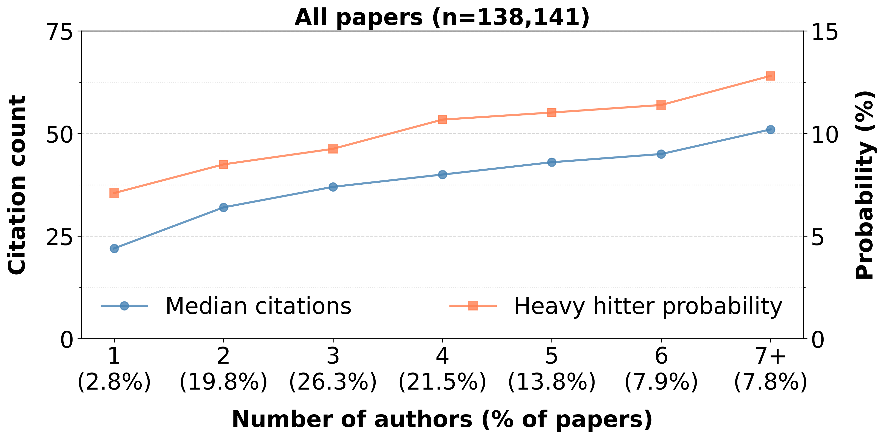

# Collaboration and citations in computer science

*Ratul Mahajan*

November, 2025

In research circles, collaboration is assumed to be an unadulterated good, the more the better. Processes and [entire buildings](https://www.scientificamerican.com/blog/observations/a-revolution-in-the-creation-of-scientific-workplaces/) are designed with the explicit purpose of encouraging collaboration, especially interdisciplinary and inter-area collaboration. As much as I love to work with other smart people, given the coordination overhead and communication frustrations that accompany collaboration, I do wonder what it's worth and whether its value can be objectively shown. So, over the last weekend (OK, two), I decided to crunch some numbers for fun. I've wanted to do this for a long time, and since modern coding agents make it so easy to do these things, I ran out of excuses.

## What I did

I wanted to study the relationship between collaboration, especially across different areas of study within computer science, and the quality of the resulting research. But good research is notoriously difficult to define, especially at scale. While a researcher may be able to classify a paper as good (or bad) after careful consideration, it's hard for them to do so for thousands of papers that are published each year and it's even harder for any large group of researchers to agree on the classification. Thus, despite its limitations, I use citation count as a proxy measure of quality, with the expectation that good research tends to be cited more. 

I crunched the numbers as follows. I started with 239,877 papers in [DBLP](https://dblp.org/), a CS-focused bibliography, that were published in the 20-year period from 2000-2020. I skipped papers published in the last 5 years to account for the [delayed citation effect](https://arxiv.org/pdf/2207.04244) for interdisciplinary research. To allow me to map a paper to its area and map its authors to their areas, I kept the papers that were published in a venue recognized by [CSRankings](https://csrankings.org/) *and* had an author recognized by CSRankings; see [CSRankings FAQ](https://csrankings.org/faq.html) for its criteria. This filtering kept 140,166 (58%) of the papers. I then pulled citation counts from [Semantic Scholar](https://www.semanticscholar.org/), using papers' DOI (digital object identifier) or title+year. I found citation information for 138,141 papers (98%); I ignored the other papers. 

## What I found

<!-- I used median because citation counts are [heavily skewed](https://arxiv.org/pdf/1607.04125). -->

The graph below plots the mean and median number of citations as a function of the number of authors. It also plots heavy hitter probability, which is the fraction of papers in the top 10% by citation count. This measure answers the question: Are collaborative papers (with more authors) more likely to be heavily cited? 

<!-- (I also tried Semantic Scholar's [influential citations](https://www.semanticscholar.org/faq/influential-citations) which is intended to "identify citations where the cited publication has a significant impact on the citing publication," but I found it to be too noisy, as [previously reported](https://www.mdpi.com/2304-6775/11/1/5?utm_source=chatgpt.com).) -->

We see a clear relationship between the number of authors and citations. For each additional collaborator, the median citation count increases by around 4 and the mean by around 7. I didn't expect the slope to be this low; in my experience, my research gets much better with collaborators. Perhaps it is not just the collaboration that matters, but collaborating with folks who know something that you don't, that is, folks outside of your area. 

So let's analyze citations as a function of the number of primary areas of authors. Areas are fields of study like vision, networking, and algorithms; CSRankings identifies 27 distinct areas. The primary area of an author is based on the venue in which they've published the most papers. This analysis excluded authors not in the CSRankings database, which to a first order implies ignoring non-faculty authors and non-CS faculty.

The graphs below show how citation metrics change as the number of areas in the paper's authorship change. The left plot is the raw metrics in the data. The right plot decouples the impact of more authors versus multiple areas—since more authors lead to more citations, as we saw above, the improvement in citations for multi-area papers could simply stem from having more authors in general. Here's how I controlled for that. For each paper set (1-area papers, 2-area papers, 3+-area papers), I created a "reference bundle" by sampling papers from the entire dataset that matched the author count distribution. If 2-area papers have 10 more citations than their reference bundle, that's a cross-area effect. The graph shows this difference, averaged over 100 random samples, with 95% confidence intervals.

We see that cross-area collaboration has limited impact. The left plot shows that going from 1 to 2 areas barely changes the mean citation count, and the right plot shows that a statistically valid advantage of multi-area papers emerges only with 3 or more areas. (As an aside, note that roughly 3 in 4 CS papers are single-area.) This surprised me even more.  

To dig deeper, I repeated this analysis for the four different area groups defined by CSRankings: AI, systems, theory, and interdisciplinary (which has areas like computational biology and HCI). The results:

Aha! This explains the disconnect between the earlier all-areas result and my own experience as a systems researcher. AI, which represents about 40% of the papers, sees almost no improvement in citations because of cross-area collaboration. In fact, we see that mean citations and heavy hitter probability actually go *down* when we go from 1-area papers to 2-area papers.  Systems and other areas have a different behavior and show a positive relationship between cross-area collaboration and citations. 

In systems, if you replace two of your same-area collaborators with two cross-area collaborators, to make it a 3-area paper, you can expect the resulting paper to get 25-40 more citations on average, which is worth 3-5 extra collaborators given the ~7 mean citation bump per additional author. It also increases your chances of writing a heavy hitter paper by 30% in relative terms, going from a baseline of 11.2% to around 14.6% (which is the 3.4% shown in the graph). I know, I know, correlation is not causation, but it's catchier to phrase it like this. 

## Conclusions

If you are an AI researcher, stop collaborating. Otherwise, collaborate more, especially with researchers from other areas. 

## Acknowledgements

This analysis would not have been possible without the great work of folks behind CSRankings, DBLP, and Semantic Scholar. 

## Appendix

All the scripts that generated the plots above are on [GitHub](https://github.com/ratulm/CollaborationCitation). If you want to play with the data, start with the README file there.

*A word to the wise:* In addition to curiosity, I did this analysis so I could play (more) with coding agents. I used Amazon Kiro with Claude Sonnet 4.5. I set out two constraints for myself at the start: (1) Do not directly edit the code, no matter how small a change I wanted to make—instead use the chat interface to specify what I want, and (2) Do not even read the code—instead judge correctness and infer behavior by inspecting the code's output (data, graphs) and asking questions via the chat interface. I succeeded with the first goal completely, but only partially with the second. There were a few times when data inspection and chat interface were not sufficient or felt too onerous. 

Why am I telling you this? So you don't judge me by the quality of the code.

